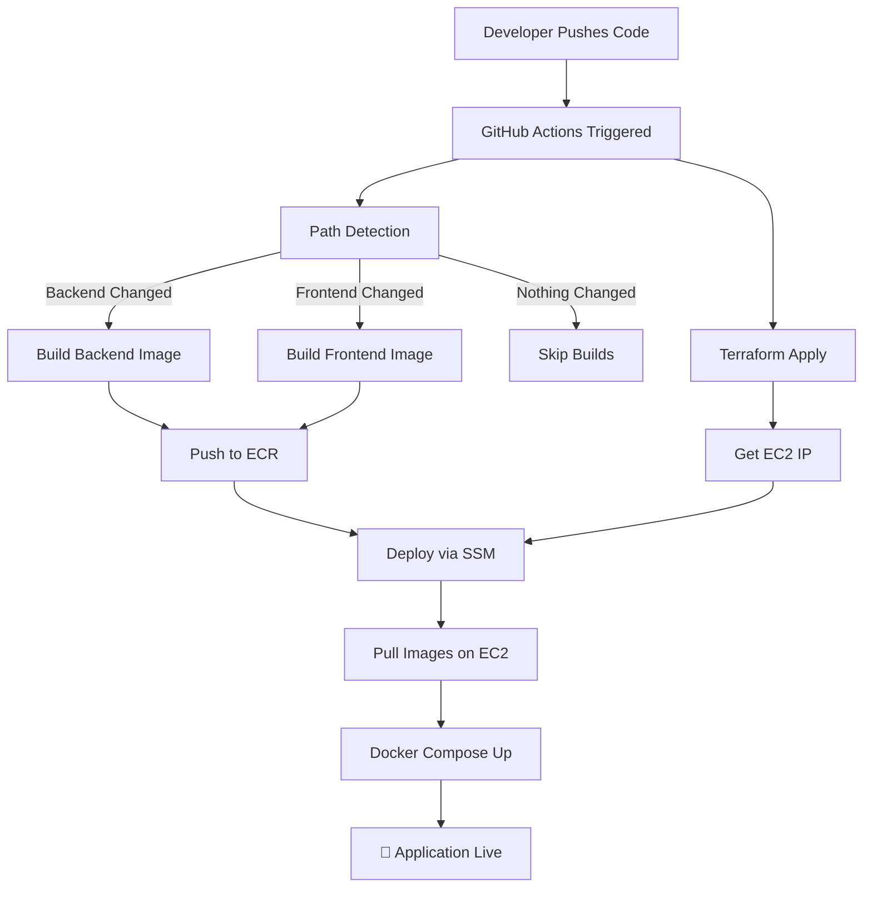
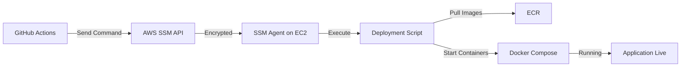

# 🚀 CI/CD Pipeline Guide

Complete guide to the production CI/CD pipeline from code push to live deployment.

---

## Pipeline Overview

The pipeline automates the entire deployment process:
1. **Detect Changes** - Identify what code changed
2. **Build Images** - Create Docker images for changed services
3. **Provision Infrastructure** - Ensure EC2 instance is ready
4. **Deploy** - Push images and start containers via SSM

**Total Time**: ~3-5 minutes from push to live

---

## Pipeline Flow



---

## Stage 1: Change Detection

### What Happens
- Compares current commit with previous commit
- Checks which directories changed
- Determines if ECR images exist (bootstrap check)

### Logic
```bash
# Check if backend code changed
if git diff --name-only HEAD^1 HEAD | grep -q "^backend/"; then
  BUILD_BACKEND=true
fi

# Check if frontend code changed  
if git diff --name-only HEAD^1 HEAD | grep -q "^frontend/"; then
  BUILD_FRONTEND=true
fi

# Check if ECR images exist
if ! aws ecr describe-images --repository-name backend --image-ids imageTag=prod-latest; then
  BUILD_BACKEND=true  # Bootstrap mode
fi
```

### Outputs
- `backend: true/false` - Should backend be built?
- `frontend: true/false` - Should frontend be built?
- `bootstrap: true/false` - Are ECR images missing?

---

## Stage 2: Build & Push

### Backend Build

**When it runs:**
- Backend code changed
- ECR image missing (bootstrap)
- Manual workflow trigger with `force_backend=true`

**What happens:**
1. Inject secrets from GitHub (`BE_PROD_ENV`)
2. Build Docker image with multi-stage Dockerfile
3. Tag with `prod-latest` and `git-sha`
4. Push to Amazon ECR
5. Use GitHub Actions cache for faster builds

**Example:**
```yaml
- name: Build and Push Backend
  uses: docker/build-push-action@v5
  with:
    context: ./backend
    push: true
    tags: |
      ${{ env.ECR_REGISTRY }}/backend:prod-latest
      ${{ env.ECR_REGISTRY }}/backend:${{ env.SHORT_SHA }}
    cache-from: type=gha
    cache-to: type=gha,mode=max
```

### Frontend Build

**When it runs:**
- Frontend code changed
- ECR image missing (bootstrap)
- Manual workflow trigger with `force_frontend=true`

**What happens:**
1. Inject secrets from GitHub (`FE_PROD_ENV`)
2. Build React app with Vite
3. Tag with `prod-latest` and `git-sha`
4. Push to Amazon ECR

**Key Feature**: Uses relative API path (`/api`) for environment-agnostic builds

---

## Stage 3: Infrastructure Provisioning

### What Happens
1. Terraform initializes with AWS credentials (OIDC)
2. Provisions/updates EC2 instance
3. Captures Public IP address
4. Commits state file back to repository

### Terraform Resources
- VPC with public subnet
- Internet Gateway
- Security Group (allows ports 80, 443)
- EC2 instance with SSM agent
- IAM role for ECR access

### Outputs
- `instance_ip` - Public IP of EC2 instance
- Used by deployment stage

---

## Stage 4: Deployment via SSM

### Why SSM?
- **No SSH keys** needed
- **No Port 22** exposure
- **AWS-managed** secure tunnel
- **Audit trail** in CloudTrail

### Deployment Steps



### Deployment Script

The workflow sends this script to EC2 via SSM:

```bash
# 1. Wait for system to be ready
sudo cloud-init status --wait

# 2. Install dependencies (if missing)
if ! command -v docker &> /dev/null; then
  sudo apt-get update && sudo apt-get install -y docker.io
fi

# 3. Login to ECR
aws ecr get-login-password --region ap-south-1 | \
  sudo docker login --username AWS --password-stdin <ECR_REGISTRY>

# 4. Pull latest images
sudo docker compose -f /home/ubuntu/docker-compose.yml pull

# 5. Start containers (zero-downtime)
sudo docker compose -f /home/ubuntu/docker-compose.yml up -d --remove-orphans
```

### Configuration Files

**nginx.conf** and **docker-compose.yml** are:
1. Read from repository
2. Domain placeholder replaced with actual domain
3. Base64-encoded for safe transmission
4. Decoded on EC2 and written to disk

---

## Branch Strategy

| Branch | Environment | Image Tag | Auto-Deploy |
|--------|-------------|-----------|-------------|
| `main` | Production | `prod-latest` | ✅ Yes |
| `DEV` | Development | `dev-latest` | ✅ Yes |
| `QA` | QA/Testing | `qa-latest` | ✅ Yes |
| `PREPROD` | Pre-Production | `preprod-latest` | ✅ Yes |

**Tag Strategy:**
- `env-latest` - Always points to latest deployment
- `git-sha` - Specific commit for rollback

---

## Manual Triggers

### Force Rebuild After Secret Changes

When you update GitHub Secrets (e.g., `FE_PROD_ENV`), the pipeline won't auto-trigger. Use manual workflow dispatch:

1. Go to **GitHub Actions**
2. Select **"Production Unified Pipeline (CI/CD)"**
3. Click **"Run workflow"**
4. Check boxes:
   - ☑️ Force rebuild backend
   - ☑️ Force rebuild frontend
5. Click **"Run workflow"**

This rebuilds services with updated secrets.

---

## Security Features

### OIDC Authentication
```yaml
permissions:
  id-token: write  # Request OIDC token
  contents: write  # Commit state file

- name: Configure AWS Credentials
  uses: aws-actions/configure-aws-credentials@v4
  with:
    role-to-assume: arn:aws:iam::${{ secrets.AWS_ACCOUNT_ID }}:role/GitHubAction
    aws-region: ap-south-1
```

**Flow:**
1. GitHub generates OIDC token
2. AWS STS validates token
3. Temporary credentials issued (1 hour)
4. No permanent keys stored

### Base64 Secret Encoding
```bash
# Encode secret on GitHub runner
ENCODED_SECRET=$(echo "$BE_SECRET" | base64 -w 0)

# Send to EC2 via SSM
aws ssm send-command --parameters "commands=['echo $ENCODED_SECRET | base64 -d > .env']"
```

**Benefits:**
- Prevents shell escaping issues
- Handles special characters safely
- No secret leakage in logs

---

## Resilience Features

### Bootstrap Mode
Automatically rebuilds missing ECR images:
```bash
# Check if image exists
if ! aws ecr describe-images --image-ids imageTag=prod-latest; then
  echo "Image missing - triggering bootstrap build"
  BUILD=true
fi
```

### Provisioning Guard
Waits for EC2 to be fully ready:
```bash
sudo cloud-init status --wait
```

### Apt Lock Handler
Handles background system updates:
```bash
wait_for_apt() {
  while fuser /var/lib/dpkg/lock-frontend >/dev/null 2>&1; do
    echo "Waiting for apt lock..."
    sleep 5
  done
}
```

### SSM Polling
Custom waiter for deployment status:
```bash
while true; do
  STATUS=$(aws ssm list-command-invocations --command-id "$CMD_ID" --query "Status")
  if [ "$STATUS" == "Success" ]; then break; fi
  if [ "$STATUS" == "Failed" ]; then exit 1; fi
  sleep 15
done
```

---

## Required GitHub Secrets

| Secret Name | Purpose | Example |
|-------------|---------|---------|
| `AWS_ACCOUNT_ID` | OIDC authentication | `123456789012` |
| `ECR_REGISTRY` | Docker image registry | `123456789012.dkr.ecr.ap-south-1.amazonaws.com` |
| `BE_PROD_ENV` | Backend environment variables | `DEBUG=False\nDATABASE_URL=...` |
| `FE_PROD_ENV` | Frontend environment variables | `VITE_API_URL=/api` |
| `APP_DOMAIN` | Custom domain (optional) | `nexgensis-assignment.rohitverma.social` |

---

## Monitoring & Debugging

### View Pipeline Logs
1. Go to **GitHub Actions**
2. Click on latest workflow run
3. Expand job steps to see detailed logs

### View Deployment Output
SSM command output is captured and displayed on failure:
```bash
aws ssm list-command-invocations \
  --command-id "$COMMAND_ID" \
  --details \
  --query "CommandInvocations[0].CommandPlugins[0].Output"
```

### Check Live Application
```bash
# View container logs
docker logs nexgensis-backend
docker logs nexgensis-frontend
docker logs nexgensis-gateway

# Check container status
docker ps

# View nginx config
docker exec nexgensis-gateway cat /etc/nginx/nginx.conf
```

---

## Rollback Procedure

### Using Git SHA Tags

Every deployment creates a git-sha tag in ECR. To rollback:

1. Find the commit SHA you want to rollback to
2. Update docker-compose.yml to use that SHA tag
3. Redeploy:
```bash
aws ssm send-command \
  --instance-ids "$INSTANCE_ID" \
  --document-name "AWS-RunShellScript" \
  --parameters "commands=['
    sudo docker compose pull
    sudo docker compose up -d --remove-orphans
  ']"
```

---

## Performance Optimization

| Feature | Impact |
|---------|--------|
| **GitHub Actions Cache** | 70% faster builds |
| **Conditional Builds** | Skip unchanged services |
| **Parallel Execution** | Build backend + frontend simultaneously |
| **ECR Image Caching** | Faster image pulls |
| **Docker Layer Caching** | Reuse unchanged layers |

---

## Related Documentation

- **[DEVOPS.md](DEVOPS.md)** - Complete DevOps guide
- **[CHALLENGES.md](CHALLENGES.md)** - Technical solutions
- **[DOMAIN_SETUP.md](DOMAIN_SETUP.md)** - Custom domain setup

---

**Pipeline Status**: Production-ready with zero-downtime deployments 🚀