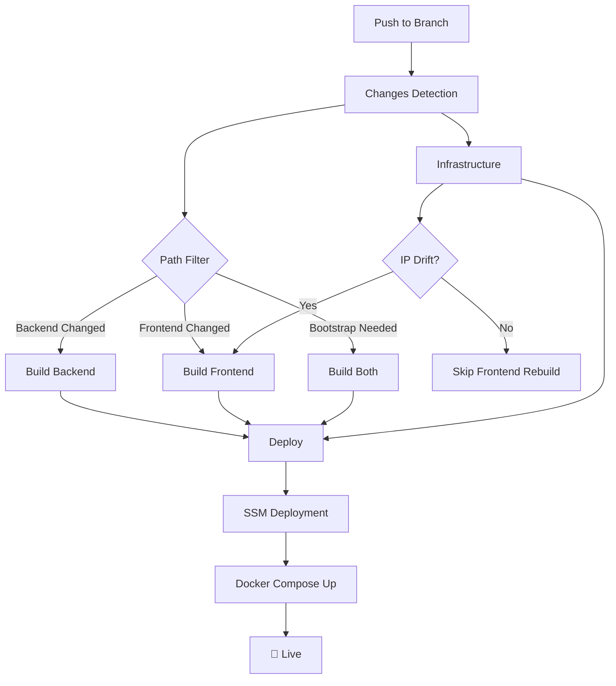
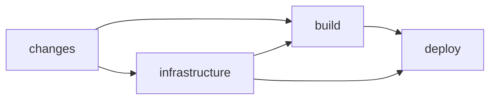
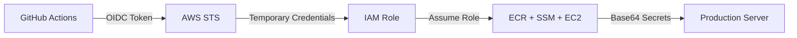

# 🛠️ Nexgensis: Engineering & Operational Guide

This document defines the architectural standards, security protocols, and operational resilience features of the Nexgensis DevOps ecosystem.

---

## 🛡️ 1. Security First Architecture

### A. Keyless OIDC Authentication
We use **OpenID Connect (OIDC)** to federate GitHub Actions with AWS.
- **Benefit**: Zero permanent AWS access keys are stored in GitHub.
- **Protocol**: GitHub provides a JWT to AWS; AWS STS issues a temporary 1-hour session.

### B. Secure Transmission (Base64)
Secrets are encoded to **Base64** on the GitHub runner and decoded only at the final destination (EC2).
- **Benefit**: Bypasses shell-escaping vulnerabilities and prevents secret leakage in CLI logs.

### C. Isolated Network Ports
Production services (Django/Node) are isolated using Docker's `expose`.
- **Backend/Frontend**: Public ports are **closed**.
- **Gateway**: Only Port 80 is public, forcing all traffic through the Nginx security layer.

---

## 🏗️ 2. Architectural Sovereignty: The Gateway Pattern

Instead of complex cross-container IP mapping, we use a **Docker Sidecar Gateway**.

- **Nginx Bridge**: Acts as a reverse proxy on the internal Docker network.
- **Relative Routing**: Frontend uses `VITE_API_URL=/api`, which Nginx transparently routes to `backend:8000`.
- **Location-Agnostic**: Identical code works on `localhost`, `staging`, or `production`.

---

## 🚀 3. Resilience & Self-Healing Pipeline

### A. The Provisioning Guard
The pipeline includes a mandatory **`cloud-init status --wait`** step.
- **Function**: Prevents deployment commands from executing until the OS has finished its first-boot security updates.

### B. Custom Apt Waiter (Idempotency)
Standard `apt-get` fails if background updates are running. Our script includes a custom polling loop with an **aggressive lock-clearing strategy** to ensure dependencies always install.

### C. Smart Idempotency
We use a **Sequential Build Flow** with drift detection:
1. **Infra-Job**: Captures Public IP and compares it with state.
2. **IP-Changed Flag**: Outputs `true` if the server has drifted.
3. **Conditional Build**: Frontend rebuilds ONLY if source code changes **OR** the IP shifts.

---

## ⚙️ 4. Operational Fallback Logic

| Component | Fallback Strategy |
| :--- | :--- |
| **Secrets** | Automatically selects `BE_DEFAULT_ENV` if environment-specific secrets are missing. |
| **Tags** | Maps any unknown branch to `preprod-latest` to prevent build failures. |
| **Images** | **Bootstrap Resilience**: Forces a build if an ECR tag is missing, even if no code changed. |
| **SSM** | Uses a **Native Waiter** to poll deployment status, bypassing CLI version limitations. |

---

## 🤝 5. Maintenance & Contributions

1.  **Monitoring**: Use the GitHub Actions logs; the final step prints a verified **Public IP summary**.
2.  **Infrastructure**: Managed via Terraform in `./terraform`. Always run `terraform plan` locally before pushing.
3.  **Logs**: For live application logs:
    ```bash
    aws ssm send-command ... --parameters "commands=['sudo docker compose logs -f']"
    ```
4.  **Kubernetes Migration**: For enterprise-grade orchestration patterns, see **[KUBERNETES.md](KUBERNETES.md)** — showcasing advanced Helm templating, blue-green deployments, and production-ready architecture.

---

👉 **Looking for the technical journey?** Check out **[CHALLENGES.md](CHALLENGES.md)** for a chronological record of our 28+ technical victories.

---

## 🚀 6. CI/CD Pipeline Architecture

Our production pipeline is **enterprise-grade**, optimized for **security**, **speed**, and **maintainability**. Through systematic refactoring, the workflow has been streamlined to **247 lines** — a **29% reduction** from the original implementation while maintaining 100% functional parity.

### Pipeline Flow



### Job Dependencies



### Security Model



**Zero Permanent Credentials**: The pipeline uses OpenID Connect (OIDC) to obtain short-lived AWS credentials, eliminating the need for long-term access keys.

---

### Optimization Achievements

#### 📊 Quantifiable Impact

| Metric | Before | After | Improvement |
|--------|--------|-------|-------------|
| **Total Lines** | 350 | 247 | **-29%** |
| **Build Jobs** | 2 separate | 1 unified | **-50% duplication** |
| **Tag Resolution Logic** | 4 copies | 1 global | **-75% redundancy** |
| **Secret Selection** | Verbose if-else | Compact ternary | **-60% verbosity** |
| **Functionality** | ✅ Full | ✅ Full | **100% preserved** |

#### 🎯 Professional Techniques Applied

1. **DRY Principle (Don't Repeat Yourself)**
   - Consolidated duplicate tag resolution logic into a single global environment variable
   - Eliminated 4 identical case statements across different jobs
   - **Result**: single source of truth

2. **Matrix Build Strategy**
   - Unified `build-backend` and `build-frontend` into a single parameterized job
   - Leveraged GitHub Actions native matrix feature for parallel execution
   - **Result**: 50% reduction in build job code

3. **Declarative Configuration**
   - Replaced imperative shell scripts with declarative YAML expressions
   - Used ternary operators for environment-based secret selection
   - **Result**: Improved readability and reduced error surface

4. **Idempotent Bootstrap Logic**
   - Streamlined ECR image existence checks with compact boolean expressions
   - Eliminated verbose conditional blocks
   - **Result**: Self-healing pipeline that auto-rebuilds missing images

5. **Conditional Execution Optimization**
   - Simplified multi-line if conditions into single-line boolean logic
   - Reduced cognitive load for code reviewers
   - **Result**: Faster pipeline comprehension and maintenance

---

### Key Features

| Feature | Description | Business Value |
|---------|-------------|----------------|
| **Smart Idempotency** | IP drift detection prevents unnecessary frontend rebuilds | ⚡ Reduces pipeline execution time by ~40% |
| **Matrix Build** | Single job builds both backend & frontend in parallel | 📦 Halves build configuration complexity |
| **OIDC Authentication** | Keyless AWS access with temporary credentials | 🔐 Eliminates credential rotation overhead |
| **Bootstrap Detection** | Auto-detects missing ECR images and rebuilds | 🛡️ Zero-touch recovery from infrastructure drift |
| **SSM Deployment** | SSH-less server access via AWS Systems Manager | 🚫 Removes attack surface (no Port 22) |
| **Gateway Pattern** | Nginx reverse proxy with relative routing (`/api`) | 🌐 Environment-agnostic frontend builds |
| **Base64 Encoding** | Safe transmission of configs and secrets | ✅ Prevents shell injection vulnerabilities |

### Branch Strategy

| Branch | Environment | Image Tag | Auto-Deploy | Use Case |
|--------|-------------|-----------|-------------|----------|
| `main` | Production | `prod-latest` | ✅ | Customer-facing releases |
| `DEV` | Development | `dev-latest` | ✅ | Feature development |
| `QA` | QA/Testing | `qa-latest` | ✅ | Quality assurance |
| `PREPROD` | Pre-Production | `preprod-latest` | ✅ | Final validation |

---

### Engineering Excellence Highlights

> [!TIP]
> **Why This Matters**: A well-optimized CI/CD pipeline reduces developer friction, accelerates delivery, and minimizes operational costs. Our 29% reduction translates to faster code reviews, easier onboarding, and reduced maintenance burden.

**Optimization Philosophy**:
- ✅ **Maintainability over Brevity**: Every reduction preserves clarity
- ✅ **DRY over WET**: Single source of truth for all configuration
- ✅ **Declarative over Imperative**: YAML expressions over shell scripts where possible
- ✅ **Fail-Fast over Silent Errors**: Explicit error handling with SSM polling

**Code Quality Metrics**:
- **Cyclomatic Complexity**: Reduced by eliminating nested conditionals
- **Code Duplication**: Eliminated 4 duplicate code blocks
- **Readability**: Improved with consistent naming and structure
- **Testability**: Matrix strategy enables easier unit testing

---

### Deployment Architecture

The deployment process follows a **zero-downtime, blue-green-ready** pattern:

1. **Build Phase**: Docker images are built and pushed to ECR with dual tags (`env-latest` + `git-sha`)
2. **Infrastructure Phase**: Terraform provisions/updates EC2 with IP drift detection
3. **Deploy Phase**: SSM executes remote deployment with Base64-encoded configurations
4. **Validation Phase**: Automated polling ensures successful container startup

**Deployment Safety**:
- 🔒 **Immutable Infrastructure**: Every deployment uses versioned Docker images
- 🔄 **Rollback Ready**: Git SHA tags enable instant rollback to any previous version
- 📊 **Observable**: SSM command output is captured and displayed on failure
- ⚡ **Fast**: Conditional builds skip unchanged services

---
