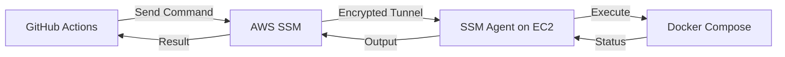
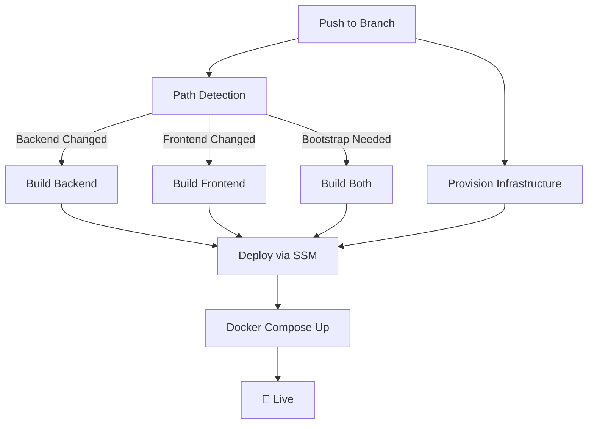
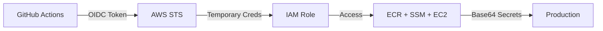

# 🛠️ Nexgensis: DevOps Engineering Guide

Complete guide to the Nexgensis DevOps ecosystem architecture, security, and operational features.

---

## 🛡️ 1. Security Architecture

### OIDC Authentication (Keyless AWS Access)
GitHub Actions authenticates with AWS using **OpenID Connect (OIDC)**:
- **Zero permanent credentials** stored in GitHub
- AWS STS issues temporary 1-hour sessions
- GitHub provides JWT token → AWS validates → Temporary access granted

### Base64 Secret Transmission
Secrets are Base64-encoded during transmission:
- Prevents shell-escaping vulnerabilities
- Avoids secret leakage in CLI logs
- Decoded only at final destination (EC2)

### Network Isolation
Services are isolated using Docker networking:
- Backend/Frontend use `expose` (not `ports`)
- Only Nginx gateway exposes port 80
- All traffic flows through security layer

---

## 🏗️ 2. Gateway Architecture

### Nginx Reverse Proxy Pattern
Instead of exposing multiple ports, we use a **single gateway**:

```
User Request → Nginx (Port 80) → Internal Docker Network
                    ↓
        /api → backend:8000
        /    → frontend:5173
```

**Benefits:**
- Frontend uses relative paths (`/api`)
- No hardcoded IPs in builds
- Works identically across all environments
- Single security checkpoint

### Cloudflare SSL Integration
HTTPS is handled by Cloudflare (Flexible mode):
- User → Cloudflare: **HTTPS** (encrypted)
- Cloudflare → Server: **HTTP** (trusted network)
- Zero certificate management needed
- Free SSL for all users

---

## 🚀 3. Self-Healing Pipeline

### Provisioning Guard
Prevents deployment before system is ready:
```bash
sudo cloud-init status --wait
```
- Waits for OS first-boot completion
- Prevents "Resource Busy" errors
- Ensures system packages are updated

### Apt Lock Handler
Custom waiter for package installation:
- Detects locked apt database
- Waits for background updates to complete
- Aggressive timeout with lock clearing
- Ensures dependencies always install

### Bootstrap Resilience
Auto-detects and fixes missing ECR images:
- Checks if image tags exist in ECR
- Forces rebuild if missing
- Self-healing on infrastructure drift
- Zero manual intervention needed

---

## ⚙️ 4. AWS Systems Manager (SSM) Deployment

### Why SSM Instead of SSH?

| Feature | SSH | SSM |
|---------|-----|-----|
| **Port 22** | Required (attack surface) | Not needed |
| **Key Management** | Manual `.pem` files | AWS-managed |
| **Security** | Permanent credentials | Temporary sessions |
| **Audit Trail** | Manual logging | CloudTrail integration |
| **Network** | Public internet | AWS private network |

### How SSM Works

1. **Command Sent**: GitHub Actions → AWS SSM API
2. **SSM Agent**: Polls for commands on EC2
3. **Execution**: Runs script in secure context
4. **Polling**: Workflow waits for completion
5. **Output**: Captured and displayed on failure

**Example SSM Command:**
```bash
aws ssm send-command \
  --instance-ids "$INSTANCE_ID" \
  --document-name "AWS-RunShellScript" \
  --parameters "commands=['docker compose up -d']"
```

### SSM Deployment Flow



---

## 🔄 5. Resilience & Fallback Logic

| Component | Fallback Strategy |
|-----------|-------------------|
| **Secrets** | Uses `DEFAULT_ENV` if branch-specific secret missing |
| **Image Tags** | Maps unknown branches to `preprod-latest` |
| **ECR Images** | Bootstrap mode rebuilds missing images |
| **SSM Polling** | Custom waiter with status checking |
| **Domain** | Falls back to EC2 IP if `APP_DOMAIN` not set |

---

## 🚀 6. CI/CD Pipeline

### Pipeline Flow



### Security Model



### Key Features

| Feature | Description | Benefit |
|---------|-------------|---------|
| **OIDC Auth** | Keyless AWS access | No credential rotation |
| **SSM Deployment** | SSH-less server access | No Port 22 exposure |
| **Gateway Pattern** | Nginx reverse proxy | Environment-agnostic builds |
| **Base64 Encoding** | Safe secret transmission | Prevents injection attacks |
| **Bootstrap Detection** | Auto-rebuild missing images | Self-healing infrastructure |
| **Manual Triggers** | Force rebuild via workflow_dispatch | Control over secret changes |

### Branch Strategy

| Branch | Environment | Image Tag | Use Case |
|--------|-------------|-----------|----------|
| `main` | Production | `prod-latest` | Customer releases |
| `DEV` | Development | `dev-latest` | Feature development |
| `QA` | QA/Testing | `qa-latest` | Quality assurance |
| `PREPROD` | Pre-Production | `preprod-latest` | Final validation |

---

## 📦 7. Deployment Architecture

### Zero-Downtime Deployment

1. **Build**: Docker images pushed to ECR with dual tags (`env-latest` + `git-sha`)
2. **Infrastructure**: Terraform provisions/updates EC2
3. **Deploy**: SSM executes remote deployment with Base64 configs
4. **Validation**: Automated polling ensures container startup

**Safety Features:**
- 🔒 **Immutable Infrastructure**: Versioned Docker images
- 🔄 **Rollback Ready**: Git SHA tags enable instant rollback
- 📊 **Observable**: SSM output captured on failure
- ⚡ **Fast**: Conditional builds skip unchanged services

---

## 🤝 8. Maintenance & Operations

### Monitoring
- GitHub Actions logs show deployment progress
- Final step displays Public IP summary
- SSM command output captured on failures

### Infrastructure Management
- Managed via Terraform in `./terraform`
- Always run `terraform plan` before pushing
- State file committed to repository

### Live Logs
```bash
aws ssm send-command \
  --instance-ids "$INSTANCE_ID" \
  --document-name "AWS-RunShellScript" \
  --parameters "commands=['sudo docker compose logs -f']"
```

### Kubernetes Migration
For enterprise-grade orchestration patterns, see **[KUBERNETES.md](KUBERNETES.md)** — showcasing advanced Helm templating, blue-green deployments, and production-ready architecture.

---

## 📚 Related Documentation

- **[CHALLENGES.md](CHALLENGES.md)** - Technical journey and solutions
- **[KUBERNETES.md](KUBERNETES.md)** - Enterprise Kubernetes patterns
- **[DOMAIN_SETUP.md](DOMAIN_SETUP.md)** - Custom domain configuration
- **[CLOUDFLARE_FIX.md](CLOUDFLARE_FIX.md)** - SSL/TLS troubleshooting

---

**Built with ❤️ for production-grade DevOps**
