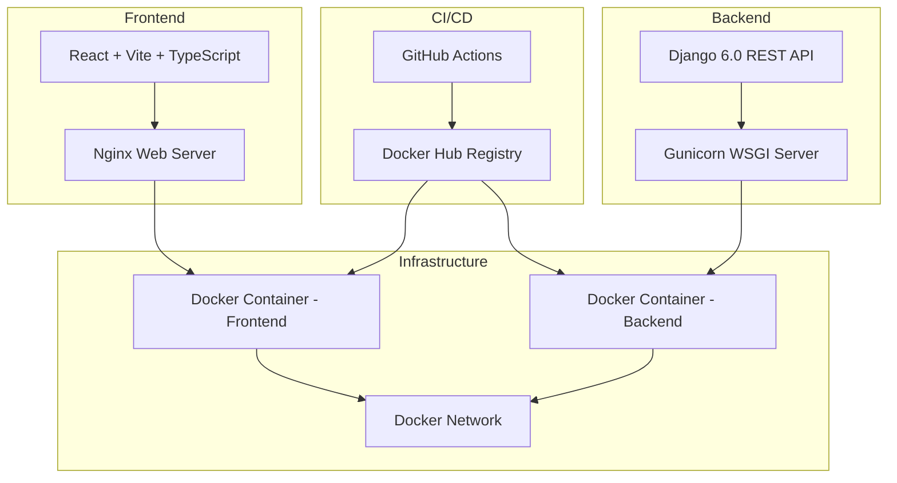

# DevOps Assessment - Complete Documentation

## 📋 Table of Contents
- [Architecture Overview](#architecture-overview)
- [Prerequisites](#prerequisites)
- [Local Development Setup](#local-development-setup)
- [Docker Setup](#docker-setup)
- [Production Deployment](#production-deployment)
- [CI/CD Pipeline](#cicd-pipeline)
- [Environment Variables](#environment-variables)
- [Troubleshooting](#troubleshooting)
- [Maintenance & Operations](#maintenance--operations)

---

## 🏗️ Architecture Overview

This is a full-stack web application with the following components:



### Technology Stack

**Backend:**
- Django 6.0 (Python web framework)
- Gunicorn (WSGI production server)
- django-cors-headers (CORS middleware)
- Python 3.11 Alpine Linux (production image)

**Frontend:**
- React 19.2 (UI library)
- Vite 7.2 (build tool)
- TypeScript (type safety)
- Axios (HTTP client)
- Nginx Alpine (production web server)

**DevOps:**
- Docker (containerization)
- Docker Compose (orchestration)
- GitHub Actions (CI/CD)
- Docker Hub (container registry)

---

## 📦 Prerequisites

### For Local Development (Without Docker)
- Python 3.10 or higher
- Node.js 18 or higher
- npm 9 or higher

### For Docker Setup
- Docker 24.0 or higher
- Docker Compose 2.0 or higher

### For CI/CD
- GitHub account
- Docker Hub account
- Git installed locally

---

## 🚀 Local Development Setup

### Backend Setup (Without Docker)

1. **Navigate to backend directory:**
   ```bash
   cd backend
   ```

2. **Create and activate virtual environment:**
   ```bash
   # Windows
   python -m venv venv
   venv\Scripts\activate

   # Linux/Mac
   python3 -m venv venv
   source venv/bin/activate
   ```

3. **Install dependencies:**
   ```bash
   pip install -r requirements.txt
   ```

4. **Run database migrations:**
   ```bash
   python manage.py migrate
   ```

5. **Start development server:**
   ```bash
   python manage.py runserver
   ```

   Backend will be available at: `http://localhost:8000/api/hello/`

### Frontend Setup (Without Docker)

1. **Navigate to frontend directory:**
   ```bash
   cd frontend
   ```

2. **Install dependencies:**
   ```bash
   npm install
   ```

3. **Start development server:**
   ```bash
   npm run dev
   ```

   Frontend will be available at: `http://localhost:5173/`

---

## 🐳 Docker Setup

### Quick Start with Docker Compose

1. **Clone the repository:**
   ```bash
   git clone https://github.com/Nexgensis/devops-assessment.git
   cd devops-assessment
   ```

2. **Create environment file:**
   ```bash
   cp .env.example .env
   ```

3. **Build and start all services:**
   ```bash
   docker-compose up -d
   ```

4. **Access the application:**
   - Frontend: `http://localhost:3000`
   - Backend API: `http://localhost:8000/api/hello/`

5. **View logs:**
   ```bash
   # All services
   docker-compose logs -f

   # Specific service
   docker-compose logs -f frontend
   docker-compose logs -f backend
   ```

6. **Stop services:**
   ```bash
   docker-compose down
   ```

### Individual Docker Image Builds

**Build Backend:**
```bash
cd backend
docker build -t devops-backend:latest .
```

**Build Frontend:**
```bash
cd frontend
docker build --build-arg VITE_API_URL=http://localhost:8000 -t devops-frontend:latest .
```

**Run Containers Manually:**
```bash
# Create network
docker network create devops-network

# Run backend
docker run -d \
  --name devops-backend \
  --network devops-network \
  -p 8000:8000 \
  -e DJANGO_DEBUG=False \
  -e DJANGO_ALLOWED_HOSTS=localhost,127.0.0.1 \
  devops-backend:latest

# Run frontend
docker run -d \
  --name devops-frontend \
  --network devops-network \
  -p 3000:80 \
  devops-frontend:latest
```

### Verify Non-Root User

Both containers run as non-root users for security:

```bash
# Check backend user
docker exec devops-backend whoami
# Should output: appuser

# Check frontend user
docker exec devops-frontend whoami
# Should output: appuser
```

### Check Image Sizes

Multi-stage builds ensure optimized image sizes:

```bash
docker images | grep devops
```

Expected sizes:
- Backend: ~150-200 MB
- Frontend: ~30-50 MB

---

## 🌐 Production Deployment

### GitHub Actions CI/CD Pipeline

The CI/CD pipeline automatically:
1. ✅ Builds Docker images on every push to `main` branch
2. ✅ Pushes images to Docker Hub with `latest` and commit SHA tags
3. ✅ Deploys to configured environment

### Setup GitHub Secrets

Configure these secrets in your GitHub repository (`Settings > Secrets and variables > Actions`):

| Secret Name | Description | Example |
|-------------|-------------|---------|
| `DOCKERHUB_USERNAME` | Your Docker Hub username | `johndoe` |
| `DOCKERHUB_TOKEN` | Docker Hub access token | Get from Docker Hub > Account Settings > Security |
| `VITE_API_URL` | Backend API URL for frontend | `https://api.yourdomain.com` |

### GitHub Actions Workflow

Two workflows are configured:

1. **`docker-build-deploy.yml`** - Main deployment workflow
   - Triggers on push to `main` branch
   - Builds and pushes images to Docker Hub
   - Deploys to production environment

2. **`pr-check.yml`** - Pull request validation
   - Triggers on pull requests to `main`
   - Builds and tests Docker images
   - Runs health checks and security scans
   - No deployment or registry push

### Cloud Deployment Options

#### Option A: Self-Hosted Runner

1. **Install GitHub runner on your server:**
   - Follow [GitHub's self-hosted runner guide](https://docs.github.com/en/actions/hosting-your-own-runners/adding-self-hosted-runners)

2. **Update deployment step in workflow:**
   ```yaml
   deploy:
     runs-on: self-hosted
     steps:
       - name: Deploy
         run: |
           cd /path/to/app
           docker-compose pull
           docker-compose up -d
   ```

#### Option B: AWS ECS

```yaml
- name: Deploy to AWS ECS
  env:
    AWS_ACCESS_KEY_ID: ${{ secrets.AWS_ACCESS_KEY_ID }}
    AWS_SECRET_ACCESS_KEY: ${{ secrets.AWS_SECRET_ACCESS_KEY }}
  run: |
    aws ecs update-service \
      --cluster devops-cluster \
      --service devops-service \
      --force-new-deployment
```

#### Option C: Google Cloud Run

```yaml
- name: Deploy to Cloud Run
  uses: google-github-actions/deploy-cloudrun@v1
  with:
    service: devops-frontend
    image: ${{ env.FRONTEND_IMAGE }}:latest
    region: us-central1
```

#### Option D: Azure Container Instances

```yaml
- name: Deploy to Azure
  uses: azure/aci-deploy@v1
  with:
    resource-group: devops-rg
    dns-name-label: devops-app
    image: ${{ env.FRONTEND_IMAGE }}:latest
    name: devops-container
```

---

## 🔧 Environment Variables

### Backend Environment Variables

| Variable | Description | Default | Required |
|----------|-------------|---------|----------|
| `DJANGO_DEBUG` | Enable debug mode | `False` | No |
| `DJANGO_ALLOWED_HOSTS` | Comma-separated allowed hosts | `localhost,127.0.0.1` | Yes |
| `DJANGO_CORS_ALLOWED_ORIGINS` | Comma-separated CORS origins | `http://localhost:3000` | Yes |
| `DJANGO_SECRET_KEY` | Django secret key | Auto-generated | Yes (Production) |

### Frontend Environment Variables

| Variable | Description | Default | Required |
|----------|-------------|---------|----------|
| `VITE_API_URL` | Backend API base URL | `http://localhost:8000` | Yes |

### Docker Compose .env Example

```env
DJANGO_DEBUG=False
DJANGO_ALLOWED_HOSTS=localhost,127.0.0.1,backend
DJANGO_CORS_ALLOWED_ORIGINS=http://localhost:3000,https://yourdomain.com
DJANGO_SECRET_KEY=your-super-secret-key-change-in-production
VITE_API_URL=http://localhost:8000
```

---

## 🔍 Troubleshooting

### Issue 1: Frontend Cannot Connect to Backend (CORS Error)

**Problem:** Browser console shows CORS errors when React app tries to fetch from Django API:
```
Access to XMLHttpRequest at 'http://localhost:8000/api/hello/' from origin 'http://localhost:3000' 
has been blocked by CORS policy
```

**Root Cause:** Django CORS settings don't include the frontend origin URL in `CORS_ALLOWED_ORIGINS`.

**Solution:**
1. Check `DJANGO_CORS_ALLOWED_ORIGINS` environment variable includes frontend URL
2. For docker-compose, ensure `.env` file has:
   ```env
   DJANGO_CORS_ALLOWED_ORIGINS=http://localhost:3000,http://localhost:5173
   ```
3. Restart backend container:
   ```bash
   docker-compose restart backend
   ```

**Prevention:** Always update CORS origins when deploying to new domains.

---

### Issue 2: Docker Build Fails with "Permission Denied"

**Problem:** Docker build fails with permission errors on Linux systems:
```
ERROR: failed to solve: failed to copy: failed to stat /app: permission denied
```

**Root Cause:** Docker daemon doesn't have permission to access project files, or SELinux is blocking access.

**Solution:**
1. Check file permissions:
   ```bash
   ls -la
   ```
2. Fix permissions if needed:
   ```bash
   sudo chown -R $USER:$USER .
   ```
3. On SELinux systems, add `:z` flag to volume mounts in docker-compose:
   ```yaml
   volumes:
     - ./backend:/app:z
   ```

**Prevention:** Ensure project files are owned by your user account, not root.

---

### Issue 3: Changes in Code Not Reflected in Running Container

**Problem:** Made changes to source code, but the running application still shows old content.

**Root Cause:** Docker images cache layers, and containers don't automatically rebuild.

**Solution:**
1. Rebuild images without cache:
   ```bash
   docker-compose build --no-cache
   ```
2. Restart containers:
   ```bash
   docker-compose up -d --force-recreate
   ```

**Prevention:** For development, use volume mounts to reflect changes immediately, or use appropriate hot-reload mechanisms.

---

### Issue 4: Container Exits Immediately After Starting

**Problem:** Container starts but exits immediately with exit code 1 or 137.

**Root Cause:** Application crashes due to missing dependencies, configuration errors, or insufficient resources.

**Solution:**
1. Check container logs:
   ```bash
   docker-compose logs backend
   docker logs devops-backend
   ```
2. Run container interactively to debug:
   ```bash
   docker run -it --rm devops-backend:latest sh
   ```
3. Verify environment variables are set correctly
4. Check memory/CPU limits if container exits with code 137

**Prevention:** Test containers locally before deploying; implement health checks.

---

## 🔧 Maintenance & Operations

### Updating the Application

1. **Pull latest changes:**
   ```bash
   git pull origin main
   ```

2. **Rebuild and restart:**
   ```bash
   docker-compose build
   docker-compose up -d
   ```

### Viewing Logs

```bash
# Real-time logs for all services
docker-compose logs -f

# Last 100 lines
docker-compose logs --tail=100

# Logs for specific service
docker-compose logs -f backend
```

### Database Migrations

```bash
# Run migrations in backend container
docker-compose exec backend python manage.py migrate

# Create new migration
docker-compose exec backend python manage.py makemigrations
```

### Container Health Monitoring

```bash
# Check container status
docker-compose ps

# Check health status
docker inspect devops-backend | grep -A 10 Health

# View resource usage
docker stats
```

### Scaling Containers

```bash
# Scale backend to 3 replicas
docker-compose up -d --scale backend=3
```

### Backup and Restore

**Backup SQLite database:**
```bash
docker cp devops-backend:/app/db.sqlite3 ./backup/db.sqlite3.$(date +%Y%m%d)
```

**Restore database:**
```bash
docker cp ./backup/db.sqlite3.20260125 devops-backend:/app/db.sqlite3
docker-compose restart backend
```

---

## 📊 Best Practices Implemented

✅ **Multi-stage Docker builds** - Optimized image sizes  
✅ **Non-root users** - Enhanced security in containers  
✅ **Environment variables** - No hardcoded secrets  
✅ **Health checks** - Container health monitoring  
✅ **Docker ignore files** - Reduced build context  
✅ **Layer caching** - Faster builds  
✅ **Automated CI/CD** - GitHub Actions workflows  
✅ **Security scanning** - Trivy integration in PR checks  
✅ **Comprehensive logging** - Structured application logs  
✅ **Documentation** - Complete setup and troubleshooting guides  

---

## 📸 Screenshots

> Note: Add screenshots of your running application here after deployment

- `docs/screenshots/local-running.png` - Application running locally
- `docs/screenshots/docker-containers.png` - Docker containers running
- `docs/screenshots/cicd-pipeline.png` - GitHub Actions success
- `docs/screenshots/docker-hub.png` - Images in Docker Hub

---

## 📞 Additional Resources

- [Django Documentation](https://docs.djangoproject.com/)
- [React Documentation](https://react.dev/)
- [Docker Documentation](https://docs.docker.com/)
- [GitHub Actions Documentation](https://docs.github.com/en/actions)
- [Nginx Documentation](https://nginx.org/en/docs/)

---

**Developed for Nexgensis DevOps Assessment**
